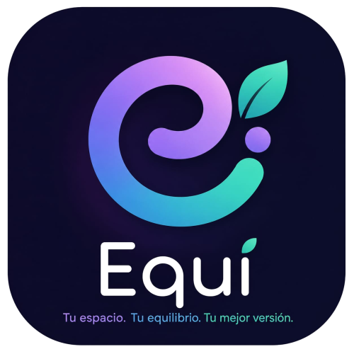

# Equi — Bienestar Emocional

<p align="center">
  
</p>

**Equi** es una iniciativa y plataforma web diseñada por estudiantes universitarios para promover la salud emocional mediante herramientas accesibles, prácticas y basadas en evidencia científica.

---

## 🚀 Características Principales

El sitio web cuenta con diversos recursos interactivos y secciones clave para el cuidado de la salud mental:

*   🧘 **Meditación Guiada:** Sesiones de 5 a 15 minutos para cultivar la atención plena.
*   📝 **Diario Emocional:** Plantillas de *journaling* para la autoconciencia.
*   🌬️ **Ejercicios de Respiración:** Técnicas para reducir los niveles de ansiedad.
*   📅 **Planificador Inteligente:** Organización de la vida académica para evitar el estrés.
*   💪 **Pausas Activas:** Rutinas y estiramientos que mitigan la fatiga mental y física.
*   🌐 **Comunidad Virtual:** Espacios seguros de escucha mutua entre estudiantes.

---

## 🛠️ Tecnologías Utilizadas

*   **HTML5:** Estructura semántica del sitio web.
*   **CSS3:** Estilos personalizados, diseño adaptativo (*Responsive Design*) y animaciones de scroll.
*   **JavaScript:** Interactividad en el menú móvil y validación dinámica de formularios de contacto.

---

## 📂 Estructura del Proyecto

Asegúrate de que tus archivos mantengan este orden al subirlos a GitHub para evitar enlaces rotos:

```text
├── images/
│   └── logo-equi.png
├── index.html
├── script.js
└── README.md
